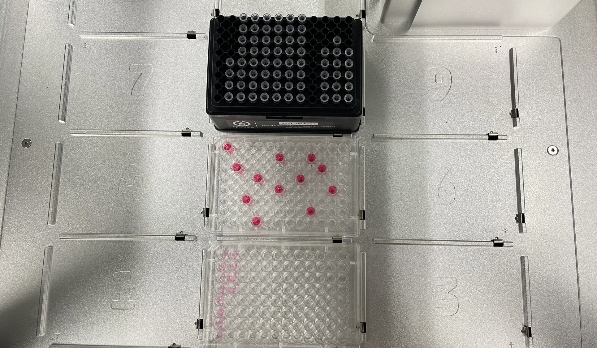

# OpenTronsProtocolGenerator

## OT-2 Labwareの配置

以下のようにチップラック、プレート(from),プレート(to)を配置する。




## 入力画面


## バックエンドの起動

バックエンドディレクトリに移動する。

```bash
cd backend
```

VENVのセットアップ

```bash
python -m venv venv
```

VENVの起動

```bash
source venv/bin/activate
```

必要モジュールのインストール

```bash
pip install -r requirements.txt
```

## フロントエンドの起動

フロントエンドディレクトリに移動。

```bash
cd frontend
```

パッケージのインストール

```bash
npm install
```

アプリケーションの起動

```bash
npm start
```

下記URLでトップページにつながる。

[http://localhost:3000/](http://localhost:3000/)


